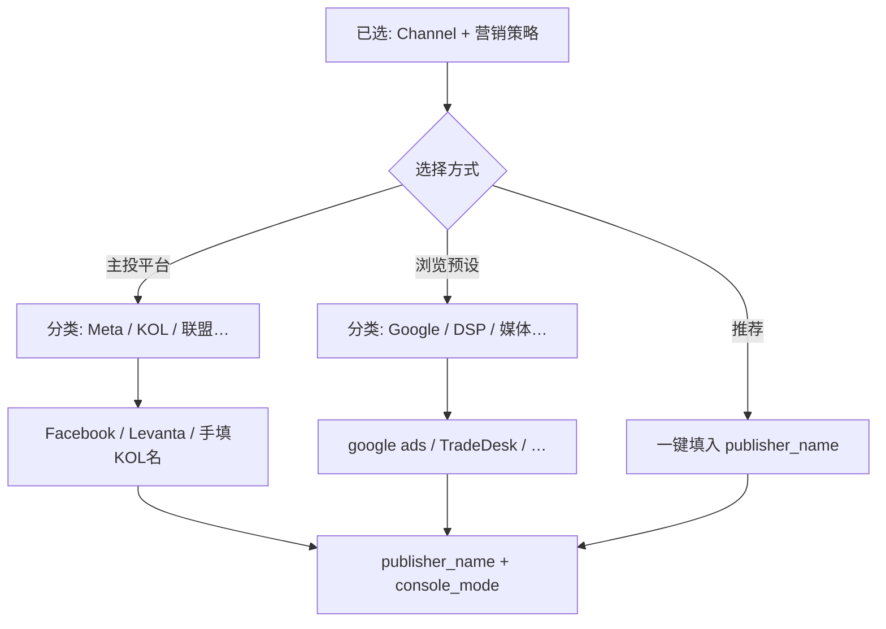

# Amazon Attribution Publisher 字典与选型规则

> **用途**：ERP Tag 向导第 4 步「Publisher」、Console Phase B5 对照、报表 `publisher_name` 对账。  
> **机器可读**：[amazon-attribution-publishers-v1.json](./amazon-attribution-publishers-v1.json)  
> **Console 原始清单**：[Amazon-Attribution-campaign-Publisher.md](../../docs/demand/Amazon-Attribution-campaign-Publisher.md)

---

## 1. Console 行为

| 选项 | 含义 | ERP 字段 |
|------|------|----------|
| **New** | 非媒体名；选中后出现 **Publisher name** 输入框 | `publisher_name` = 手填值（与 Console 完全一致） |
| **预设 83 项** | 下拉直接选择 | `publisher_name` = 该项 `console_label`（注意大小写，如 `google ads`、`Youtube`） |

**Channel 与 Publisher 独立**：例如预设里有 `Paid social`，它是 Publisher 标签，不等于 Channel 选 Social 就自动填好。

---

## 2. 预设清单结构

共 **83** 个预设（不含 New），按 `category` 分组见 JSON `presets[]`。

| 分类 | 说明 | P0 常涉及 |
|------|------|-----------|
| `google` | Google Ads / GDN / Youtube | `google ads`、`Youtube` |
| `dsp` | TradeDesk、AdRoll、MediaMath… | `TradeDesk`、`AdRoll` |
| `social_community` | Reddit、Vimeo 等 | `Reddit` |
| `brand_owned` | 账户内历史项 | `Govee.com`、`GoveeHomeApp` |
| `generic_bucket` | App、DSP、Paid social… | 仅作兜底，优先 New+明确平台名 |

**不在预设中的主投平台**（须 **New**）：Facebook、Instagram、TikTok、Levanta、Klaviyo、Microsoft Advertising 等。

---

## 3. P0 营销策略 → Publisher 选型（速查）

完整表见 JSON `strategy_publisher_selection[]` 与 Excel 工作表 **「Publisher选型」**。

| 场景 | amazon_channel | 营销策略 | Console Publisher |
|------|----------------|----------|-------------------|
| Google 搜索 | Search | paid_search · * | **预设** `google ads`（Bulk 同路径） |
| Meta 付费 | Social | paid_social · psoc_* | **New** `Facebook` / `Instagram`（**Bulk** 以亚马逊生成值为准） |
| 付费 KOL | Social | paid_social · psoc_influencer | **New** + 达人名或平台 |
| 品牌 SNS | Social | organic_social · osoc_brand_owned | **New** `Instagram` 等 |
| 联盟 | Social | affiliate · * | **New** `Levanta` / `Impact` 等 |
| YouTube 视频 | Video | paid_video · pv_generic | **预设** `Youtube` |
| 程序化展示 | Display | display · dsp_* | **预设** `TradeDesk`/`AdRoll` 或 **New** DSP 名 |
| EDM | Email | email · * | **New** `Klaviyo` 等 |

---

## 4. ERP 创建向导：先分类、再选 Publisher（v1.1）

> **问题**：Console 有 83 个预设，平铺下拉不清晰。  
> **方案**：ERP 分三步——**选择方式 → 平台分类 → 具体 Publisher**；主投平台（Meta/联盟/KOL）与亚马逊预设分开。

### 4.1 交互流程（② Tag 中心 · Step Publisher）

```text
Step 5a  选择方式（单选卡片）
         ├─ 【推荐】使用系统推荐（已选营销策略时默认）
         ├─ 【主投平台】Meta / TikTok / 联盟 / KOL / 邮件…（Console 须选 New）
         └─ 【浏览预设】按分类查看亚马逊 83 项（Console 直接选同名预设）

Step 5b  平台分类（卡片/侧栏，随方式变化）
         · 主投平台 → meta | tiktok | kol | affiliate | email_tools | …
         · 浏览预设 → Google 系 | DSP | 社区/视频 | 品牌自有 | …（可折叠「媒体/内容方」）

Step 5c  具体 Publisher
         · 主投平台 → 点选 Facebook / Levanta 或手填达人名
         · 浏览预设 → 分类下列表，支持搜索；选中项 = publisher_name
```

**按 `amazon_channel` 默认展开**（见 JSON `channel_ui_defaults`）：

| Channel | 默认方式 | 优先展示分类 |
|---------|----------|----------------|
| Search | 推荐 / 预设 | Google 系 |
| Social | 推荐 / **主投平台** | Meta → KOL → 联盟 |
| Display | 推荐 / 预设 | DSP → Google |
| Video | 推荐 / 预设 | Google（Youtube）+ TikTok 主投 |
| Email | **主投平台** | 邮件工具（无预设） |

### 4.2 界面示意（Mermaid）



### 4.3 写入字段

| ERP 字段 | 说明 |
|----------|------|
| `publisher_pick_mode` | `recommended` \| `custom_platform` \| `amazon_preset_browse` |
| `publisher_category_code` | 预设分类 `google`… 或主投分组 `meta`… |
| `publisher_name` | 最终值，与 Console 一致 |
| `console_publisher_mode` | `preset` \| `new_custom` |

机器配置：`amazon-attribution-publishers-v1.json` → **`erp_publisher_wizard`**。

Excel 工作表：**「ERP Publisher向导」**（分类与主投平台一览）。

### 4.4 校验建议

1. `console_publisher_mode = preset` 时：`publisher_name` 必须 ∈ `presets[].console_label`。  
2. `console_publisher_mode = new_custom` 时：`publisher_name` 非空，且 ≠ `New`。  
3. 禁止把 `strategy_minor_code` 写入 Publisher（策略与媒体分离）。  
4. 创建完成后回写 Console 实际 Publisher，供报表 join。  
5. P0 向导默认 **折叠** `媒体/内容方` 等长尾分类（`erp_collapsed_by_default`），可展开搜索。

---

## 5. 与渠道字典关系

```text
channel-taxonomy-v1.json     →  amazon_channel + strategy_* + name_short
amazon-attribution-publishers-v1.json  →  publisher_name 如何填 Console
```

`typical_publishers` 为业务口语；**落地以本字典 `strategy_publisher_selection` 为准**。

---

作者：@beynawoo-code
