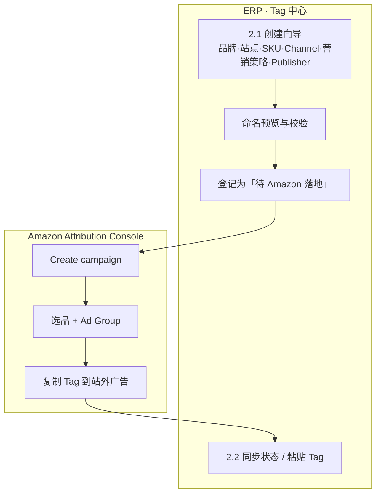

# Amazon Attribution 创建 SOP

> **一页速览**：ERP 负责**命名规范 + 元数据登记**；Amazon Advertising Console 负责**Campaign / Ad Group / Tag 实测**；报表经 Attribution API 或控制台回流 ERP。**Campaign 结构无法仅靠 API 创建**（见 §6）。

| 维度 | 说明 |
|------|------|
| **主责角色** | CP（渠道推广） |
| **适用站点** | US / CA / UK / DE / FR / IT / ES（与 Attribution 开放市场一致） |
| **资格** | Brand Registry 专业卖家、Vendor 或代理商代操 |
| **入口（Amazon）** | Advertising Console → Measurement & Reporting → **Amazon Attribution** |
| **入口（ERP）** | 旗舰店子系统 → **② Tag 中心** → 2.1 创建向导 / 2.2 列表同步 |
| **渠道字典** | **[v1.2 Amazon Channel + 营销策略](./channel-taxonomy-v1.md)**（Console 五选一 + 内部大小类 + Publisher） |

---

## 1. 双轨流程总览

| 路径 | 何时使用 | Amazon 侧创建方式 |
|------|----------|-------------------|
| **标准路径** | 单条或少量 Tag（KOL / SNS / 联盟 / 独立落地页等） | **Create manually** |
| **批量路径** | Google Search 或 Facebook / Instagram 大规模打 Tag | **Upload file**（单文件最多约 10 万关键词 / 8,500 条 Meta 广告） |

---

## 2. 标准路径：步骤清单

### Phase A — ERP 内（必须先做）

| 步 | 操作 | 产出 |
|:--:|------|------|
| A1 | 进入 **Tag 中心 → 创建向导**：**品牌 → 站点 → SKU → Amazon Channel → 营销大类 → 营销子类 → Publisher（推荐 / 主投平台分类 / 浏览预设分类 → 具体项）→（若红人）是否付费 → 活动日期** | 见 [渠道字典 v1.2](./channel-taxonomy-v1.md) · [Publisher ERP 向导](./amazon-attribution-publishers-v1.md#4-erp-创建向导先分类再选-publisherv11) |
| A2 | 查看 **命名预览与校验**：无冲突则提交；有冲突则改日期/渠道或走 SO 确认 SKU | ERP 记录 `tag_request_id`，状态 `pending_amazon` |
| A3 | 记录向导中的 **建议 Campaign 名、Ad Group 名、落地页类型（PDP / Store）** | 供 Phase B 照抄，避免 Console 随意起名 |

> **强约束（K1）**：`canonical_name` = `{品牌}-{站点}-{SKU}-{name_short}-{YYYYMMDD}`，其中 `name_short` = 营销大类短码 + 营销子类后缀（例 `PSoINF`）。完整规则见 [渠道字典 §5](./channel-taxonomy-v1.md#51-短码规则v12--全局唯一)。**禁止**单独使用子类后缀（如仅 `INF`）。**禁止**在 Excel 或 Console 自造与 ERP 不一致的名称。

### Phase B — Amazon Console（官方 SOP 对齐）

| 步 | 操作 | 对应 Amazon 字段 |
|:--:|------|------------------|
| B1 | 登录 [Advertising Console](https://advertising.amazon.ca/sign-in) → **Measurement & Reporting → Amazon Attribution** → **Create campaign** | — |
| B2 | **Creation method** 选 **Create manually** | `creation_method` |
| B3 | **Products**：选择推广 SKU；有变体用 **Add variations**；缺货/无图/无价不可选；Variation parent 不在列表中 | `measured_asins[]` |
| B4 | **Ad group name**：粘贴 ERP 的 `canonical_name`（或 `ad_group_name_suggested`） | `ad_group_name` |
| B5 | **Publisher**：按 [Publisher 字典](./amazon-attribution-publishers-v1.md) — 能选预设则选（如 `google ads`、`Youtube`）；**Facebook/Instagram/联盟/KOL** 等用 **New** + 手填 `publisher_name` | `publisher` |
| B6 | **Channel**：与 ERP **`amazon_channel`** 一致（Search / Social / Video / Email / Display，**勿**用营销大类推导） | `amazon_channel` |
| B7 | **Click-through URL**：单品目标 → PDP；多品/品牌 → **Brand Store** | `click_through_url` |
| B8 | 保存后复制 **Attribution Tag**（完整 query 或落地 URL+参数） | `attribution_tag_raw` |
| B9 | 将 Tag 填入站外广告最终 URL（Meta / Google / KOL 后台等） | — |

### Phase C — 回写 ERP

| 步 | 操作 | 系统字段更新 |
|:--:|------|----------------|
| C1 | **Tag 列表 → 链接与 Attribution 同步**，粘贴 Tag 或填写 Amazon Campaign / Ad Group 外部 ID | `attribution_tag_raw`, `amazon_campaign_id`, `amazon_ad_group_id` |
| C2 | 状态改为 **active**；若 7 日内无点击可保持 `active` 或按规范 **归档** | `status` |
| C3 | （可选）等待 **Attribution API** 定时任务拉报表，或在 Console 核对首周数据 | `last_report_sync_at` |

---

## 3. 批量路径：Google / Meta（仅大规模投放）

| 步 | 操作 | 说明 |
|:--:|------|------|
| B1 | ERP 仍建议 **批量创建模板** 导出 `canonical_name` 列，作为 bulk 文件中的命名参考 | 与 §2 Phase A 对齐 |
| B2 | Console 选 **Upload file to create in bulk** | 仅 **Google Search**、**Facebook / Instagram** |
| B3 | 上传前在 ERP/Excel 确定 **本批共用 ASIN 集合**（bulk 内商品一致；不同商品集拆文件） | 见 [Bulk upload](https://advertising.amazon.ca/help/GD3X8KXBFKKC4BRJ) |
| B4 | 下载 **tag sheets** → 导入 **Google Ads**（Keywords → More → Upload）或 **Meta Ads Manager**（Import Ads） | 再次上传时 **旧 Tag 复用、新 Tag 新建** |
| C1 | ERP **批量导入** 关联 `bulk_batch_id`、平台、`external_ad_id` ↔ `canonical_name` | P0 可先 CSV，P1 对接 API 报表 `groupBy=CREATIVE` |

---

## 4. 字段字典（Amazon Console）

| 字段（Console） | 必填 | 说明与约束 |
|-----------------|:----:|------------|
| Campaign name | 是 | 仅 Console 内可见；建议 `{品牌}_{站点}_{活动主题}_{YYYYMM}`，与 ERP `campaign_name` 一致 |
| Creation method | 是 | `manual` \| `bulk_upload` |
| Products (ASIN) | 是 | 在库、有图有价；推广 SKU + 变体；同品牌非推广品计入 **Total** 指标 |
| Ad group name | 是 | **必须与 ERP `canonical_name` 一致**（治理与报表 join 键） |
| Publisher | 是 | 83 项预设或 **New**（见 [amazon-attribution-publishers-v1.json](./amazon-attribution-publishers-v1.json)）；须与 ERP `publisher_name` 一致 |
| Channel | 是 | `search` \| `social` \| `display` \| `video` \| `email`（Amazon 枚举） |
| Click-through URL | 是 | Amazon PDP 或 Store URL |
| Attribution Tag | 生成 | 挂在站外广告最终 URL；macro 渠道（Google/Meta）可用 API 模板 Tag |

---

## 5. ERP ↔ Amazon 字段映射表

### 5.1 主数据映射（创建向导 → Console）

| ERP 字段（逻辑名） | 类型 | 来源/规则 | Amazon Console 字段 | 同步方向 | 备注 |
|--------------------|------|-----------|---------------------|----------|------|
| `tag_request_id` | UUID | 系统生成 | — | ERP only | 主键 |
| `brand_code` | string | 品牌主数据 | —（写入 Campaign/Ad group 命名） | ERP → 命名 | 如 `Govee` |
| `marketplace_code` | enum | 站点字典（US/CA/UK/…） | Profile / 站点上下文 | ERP → Console | 决定登录 Profile |
| `sku` | string | SKU 主数据 | Products 选品 | ERP → Console | 展开为 `measured_asins[]` |
| `measured_asins` | string[] | SKU→ASIN 解析 | Products | ERP → Console | 含变体 ASIN |
| `amazon_channel` | enum | **L0** Console Channel（5 选 1） | Amazon **Channel** | ERP → Console **照抄** | search / social / video / email / display |
| `strategy_major_code` | enum | **L1** 营销大类（内部） | — | ERP only | 按 Channel 过滤；别名 `channel_major_code` |
| `strategy_minor_code` | enum | **L2** 营销子类（内部） | — | ERP only | 须属于所选营销大类；别名 `channel_minor_code` |
| `paid_flag` | bool | 是否付费合作 | — | ERP | KOL 等场景必填 |
| `legacy_channel_type` | enum | 旧口径 KOL/SNS/…（只读迁移） | — | 历史 | 新 Tag 不用 |
| `activity_date` | date | 用户选择 | 嵌入 `canonical_name` | ERP → 命名 | 格式 `YYYYMMDD` |
| `name_short` | string | `name_short_major` + `name_short_suffix` | 嵌入 `canonical_name` | 字典只读 | **全局唯一** |
| `canonical_name` | string | `{brand}-{marketplace}-{sku}-{name_short}-{YYYYMMDD}` | **Ad group name** | ERP → Console **照抄** | 报表 join 键 |
| `campaign_name_suggested` | string | `{brand}_{marketplace}_{sku}_{theme}_{YYYYMM}` | **Campaign name** | ERP → 建议 | 可人工微调主题词 |
| `landing_page_type` | enum | `pdp` \| `store` | Click-through URL 选型 | ERP → Console | Store 需 SO 维护页面 URL |
| `store_page_url` | url | 旗舰店页面映射 | Click-through URL（store） | SO/ERP → Console | 来自 ② 站点-场景 |
| `pdp_url` | url | ASIN 构造 | Click-through URL（pdp） | ERP → Console | — |
| `publisher_name` | string | 投放平台（Google、Facebook、Instagram、KOL 名、联盟平台） | Publisher / New | ERP → Console | **不在 Channel 枚举内** |
| `creation_method` | enum | `erp_wizard` \| `bulk_upload` | Creation method | 双向登记 | — |
| `status` | enum | `draft` \| `pending_amazon` \| `active` \| `archived` | — | ERP 状态机 | Console 无等价状态 |
| `attribution_tag_raw` | text | Console 复制 / API | Attribution Tag | Console/API → ERP | 敏感，勿改参数 |
| `amazon_campaign_id` | string | Console 或报表 | campaignId（API 报表） | Console → ERP | PERFORMANCE 报表维度 |
| `amazon_ad_group_id` | string | Console 或报表 | adGroupId | Console → ERP | 与 `canonical_name` 对账 |
| `amazon_advertiser_id` | string | GET `/attribution/advertisers` | advertiserIds | API → ERP | Vendor 可能多 advertiser |
| `amazon_profile_id` | string | Ads API Profiles | Amazon-Advertising-API-Scope | 集成中心配置 | — |
| `bulk_batch_id` | string | 批量任务号 | bulk 文件批次 | ERP ↔ Console | 仅 bulk 路径 |
| `external_ad_id` | string | 站外平台广告 ID | aa_creativeid 等宏替换值 | 站外 → ERP | 报表 CREATIVE 粒度 |
| `last_report_sync_at` | datetime | 定时任务 | POST `/attribution/report` | API → ERP | — |

### 5.2 Amazon Channel · 营销策略（权威字典）

**完整定义** 见 [channel-taxonomy-v1.md](./channel-taxonomy-v1.md) · [JSON](./channel-taxonomy-v1.json) · [HTML](./channel-taxonomy-v1.html)

**Console Channel（L0，仅 5 项）**：

| `amazon_channel` | Console 显示 | 典型 Publisher | Bulk |
|------------------|--------------|----------------|:----:|
| `search` | Search | Google, Microsoft Advertising | Google Search |
| `social` | Social | Facebook, Instagram, TikTok, Levanta | Meta 广告 |
| `display` | Display | TTD, DV360 | 否 |
| `video` | Video | YouTube, TikTok | 否 |
| `email` | Email | Klaviyo, Mailchimp | 否 |

**营销策略（L1/L2）** 挂在各 Channel 下，例如 Social 下：`paid_social` / `organic_social` / `affiliate` 及子类（KOL → `psoc_influencer` 或 `osoc_influencer` + `paid_flag`）。

**旧 `KOL` / `SNS` / `Paid-*`**：见字典 §6（含 `amazon_channel`）。

### 5.2.1 Publisher 选型（Console 落地）

| 文档 | 用途 |
|------|------|
| [amazon-attribution-publishers-v1.md](./amazon-attribution-publishers-v1.md) | 规则说明 |
| [amazon-attribution-publishers-v1.json](./amazon-attribution-publishers-v1.json) | ERP 种子 + `strategy_publisher_selection` |
| [channel-taxonomy-v1.xlsx](./channel-taxonomy-v1.xlsx) 工作表 **Publisher选型** | CP 速查表 |

**要点**：Meta（FB/IG）不在亚马逊预设列表 → 手工路径 **New**；Google 搜索 → 预设 **`google ads`**；Bulk 路径 Publisher 以亚马逊生成结果为准。

### 5.3 报表指标映射（API / Console → ERP 看板）

| Amazon 报表 metric（API） | ERP 看板字段 | 说明 |
|---------------------------|--------------|------|
| Click-throughs | `clicks` | — |
| attributedDetailPageViewsClicks14d | `dpv` | 推广 ASIN |
| attributedPurchases14d | `orders` | 14 天 last-touch |
| attributedSales14d | `sales` | 本地币种 |
| attributedNewToBrandPurchases14d | `ntb_orders` | PRODUCTS 报表 |
| brb_bonus_amount | `brb_bonus` | 仅 US Seller + BRB  enrolled |
| totalAttributedSales14d | `total_sales` | 含 brand halo |

---

## 6. API 与 Console 分工（实施必读）

| 能力 | Console | Attribution API |
|------|:-------:|:---------------:|
| 创建 Campaign / Ad Group / 选品 | ✅ | ❌ |
| 获取 macro / nonMacro Tag 模板 | ✅（界面复制） | ✅ GET `/attribution/tags/*` |
| Google/Meta 万级 Tag | ✅ Bulk | 不等同 Bulk 全流程 |
| 拉取 PERFORMANCE / PRODUCTS 报表 | ✅ 下载 | ✅ POST `/attribution/report` |

**产品含义**：P0「Tag 自助创建」= ERP 向导 + 强命名 + **跳转/指引 Console 落地** + API/手工回写 Tag；非「ERP 内一键调 API 建 Campaign」。

---

## 7. 验收检查表（CP 提交前勾选）

- [ ] ERP 已存在 `tag_request_id`，`canonical_name` 通过校验且无冲突
- [ ] Amazon Ad group name **与** `canonical_name` **完全一致**
- [ ] 所选 ASIN 在库、有图有价；变体已 Add variations
- [ ] Channel / Publisher 与真实站外投放一致
- [ ] Click-through URL 与目标一致（PDP vs Store）
- [ ] `attribution_tag_raw` 已回写 ERP，状态 `active`
- [ ] 站外广告 URL 已挂 Tag，抽查一次点击跳转 Amazon 正常
- [ ] （US Seller）如需 BRB，已 enrollment 且报表含 `brb_bonus` 维度

---

## 8. 截图占位（v0.1 待补）

| 编号 | 画面 | 文件占位 |
|------|------|----------|
| S1 | Attribution 入口：Measurement & Reporting | `assets/sop/attribution-01-entry.png` |
| S2 | Create campaign → Create manually | `assets/sop/attribution-02-create-manual.png` |
| S3 | Products + Add variations | `assets/sop/attribution-03-products.png` |
| S4 | Ad group 五字段 + Tag 复制 | `assets/sop/attribution-04-adgroup-tag.png` |
| S5 | ERP 创建向导与命名预览 | `assets/sop/attribution-05-erp-wizard.png` |
| S6 | ERP 同步回写 | `assets/sop/attribution-06-erp-sync.png` |

---

## 9. 参考链接

| 文档 | URL |
|------|-----|
| Create an Amazon Attribution campaign（CA Help） | https://advertising.amazon.ca/help/GJXTJCLK4WTWTQWU |
| Bulk upload campaign data | https://advertising.amazon.ca/help/GD3X8KXBFKKC4BRJ |
| Amazon Attribution API 指南 | https://advertising.amazon.com/API/docs/en-us/guides/amazon-attribution/how-to |
| 完整产品指南（含 API 收益说明） | https://advertising.amazon.com/en-ca/library/guides/basics-of-amazon-attribution |

---

## 10. 文档版本

| 版本 | 日期 | 说明 |
|------|------|------|
| v0.1 | 2026-05-19 | 首版：双轨步骤 + 字段字典 + ERP 映射表；对齐 L2 菜单 ② Tag 中心 / ⑦.4 SOP |
| v0.2 | 2026-05-19 | 渠道改为大类/子类；引用 channel-taxonomy-v1 |
| v0.3 | 2026-05-19 | L0 Amazon Channel 五选一；营销策略 + Publisher；对齐 taxonomy v1.2 |
| v0.4 | 2026-05-19 | Publisher 字典落地；B5 引用 amazon-attribution-publishers-v1 |

---

**可视化版**：[attribution-campaign-create-sop.html](./attribution-campaign-create-sop.html)（浏览器打开，含流程图与侧栏导航）  
**渠道字典**：[channel-taxonomy-v1.html](./channel-taxonomy-v1.html) · [channel-taxonomy-v1.md](./channel-taxonomy-v1.md) · [channel-taxonomy-v1.json](./channel-taxonomy-v1.json)

---

作者：@beynawoo-code
