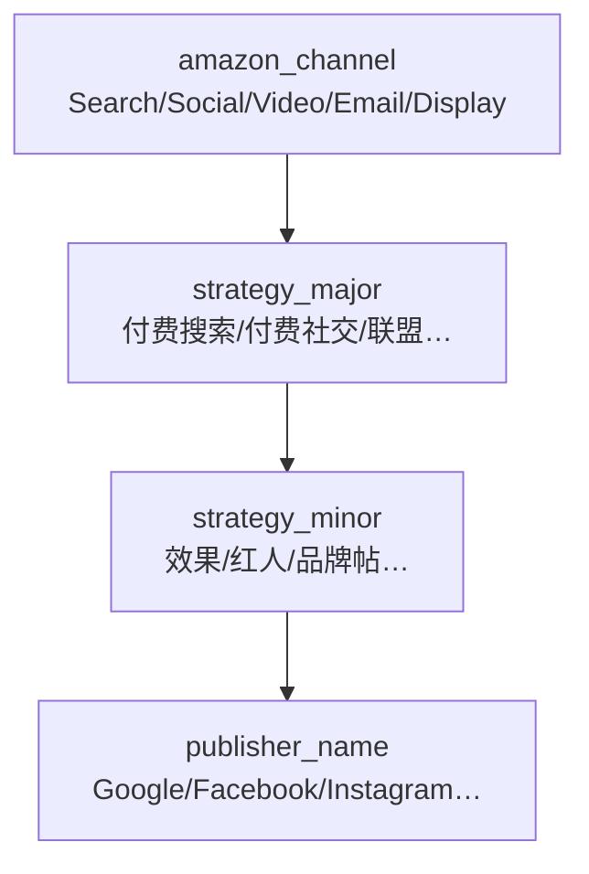

# 站外引流渠道字典 v1.2（亚马逊 Channel · 营销策略）

> **设计目标**：与 [Amazon Attribution Console](https://advertising.amazon.ca/help/GJXTJCLK4WTWTQWU) **Channel 五选一** 对齐；大小类仅描述**内部营销类型策略**；**Google / Facebook / Instagram** 等落在 **Publisher**。  
> **v1.2 变更**：原「大类/子类」不再等同 GA4 一级渠道；**先选 Amazon Channel，再选营销策略**。

---

## 0. 亚马逊 Console：Channel 仅 5 项（L0）

创建 Ad Group 时 **Channel 下拉固定**，与 ERP 字段 `amazon_channel` 一一对应：

| Console 显示 | `amazon_channel` | 中文 |
|--------------|------------------|------|
| **Search** | `search` | 搜索 |
| **Social** | `social` | 社交 |
| **Video** | `video` | 视频 |
| **Email** | `email` | 邮件 |
| **Display** | `display` | 展示 |

> Google / Facebook / Instagram / TikTok / Levanta 等 **不在此列**，填 **Publisher**（见 §6）。

---

## 1. 模型总览（三层 + Publisher）

```text
tag_request
├── amazon_channel         ← L0 亚马逊 Channel（5 选 1，与 Console 一致）
├── strategy_major_code    ← L1 营销大类（内部策略类型）
├── strategy_minor_code    ← L2 营销子类（内部战术）
├── publisher_name         ← 投放平台（Google / Meta / KOL / 联盟…）
├── paid_flag              ← 红人/合作是否付费
├── name_short             ← 营销短码组合（不含 amazon_channel）
├── canonical_name       ← {brand}-{site}-{sku}-{name_short}-{date}
└── traffic_bucket         ← 站内 SB/Organic/Other（正交维度）
```



| 层级 | 字段 | 对应 Console | 说明 |
|------|------|--------------|------|
| **L0** | `amazon_channel` | **Channel** 下拉 | 仅 5 项 |
| **L1** | `strategy_major_code` | —（ERP 内部） | 营销大类 |
| **L2** | `strategy_minor_code` | —（ERP 内部） | 营销子类 |
| **平台** | `publisher_name` | **Publisher** | Google、FB、IG、New+KOL名 |

**兼容别名**（v1.0 文档/代码）：`channel_major_code` → `strategy_major_code`；`channel_minor_code` → `strategy_minor_code`。

---

## 2. 按 Amazon Channel 归类的营销策略（L1 · L2）

### 2.1 Search · 搜索

| 营销大类 | 营销子类（P0 加粗） | name_short | 典型 Publisher |
|----------|----------------------|------------|----------------|
| `paid_search` | **ps_performance** · **ps_brand** · **ps_generic** | PSPF / PSBR / PSGEN | Google, Microsoft Advertising |
| `paid_shopping` | pshop_generic | PShGEN | Google, Pinterest |

**Bulk**：仅 **Google Search 关键词** → Channel 选 **Search**，Publisher 选 **Google**。

### 2.2 Social · 社交

| 营销大类 | 营销子类（P0） | name_short | 典型 Publisher |
|----------|----------------|------------|----------------|
| `paid_social` | **psoc_performance** · **psoc_retargeting** · **psoc_influencer** · **psoc_generic** | PSoPF / PSoRT / **PSoINF** / PSoGEN | **Facebook**, **Instagram**, TikTok |
| `organic_social` | **osoc_brand_owned** · **osoc_influencer** · **osoc_generic** | OSoBO / **OSoINF** / OSoGEN | IG/FB 品牌号；New KOL名 |
| `affiliate` | **aff_network** · **aff_creator** · **aff_generic** | AFFNET / AFFCR / AFFGEN | Levanta, Impact |
| `paid_other` | pother_generic | POGEN | New |

**Bulk**：**Facebook / Instagram 广告** → Channel 选 **Social**，Publisher 选 FB/IG。

原 **KOL / SNS / Paid-Social** 均落在此 Channel 下不同营销策略 + Publisher。

### 2.3 Display · 展示

| 营销大类 | 营销子类 | name_short | 典型 Publisher |
|----------|----------|------------|----------------|
| `display` | dsp_generic（P0 扩展） | DSPGEN | TTD, DV360, New |
| `cross_network` | xnet_pmax / xnet_generic | XNPM / XNGEN | Google PMax |

### 2.4 Video · 视频

| 营销大类 | 营销子类 | name_short | 典型 Publisher |
|----------|----------|------------|----------------|
| `paid_video` | pv_generic | PVGEN | YouTube, TikTok |
| `organic_video` | ov_generic | OVGEN | YouTube |

### 2.5 Email · 邮件

| 营销大类 | 营销子类 | name_short | 典型 Publisher |
|----------|----------|------------|----------------|
| `email` | em_promo / em_generic | EMLPR / EMLGEN | Klaviyo, Mailchimp |

---

## 2.6 P0 创建向导（推荐顺序）

1. **Amazon Channel**（5 选 1，与截图一致）  
2. **营销大类** → **营销子类**（列表按 Channel 过滤）  
3. **Publisher**（**先分类再选具体项**，见 [Publisher 字典 §4](./amazon-attribution-publishers-v1.md#4-erp-创建向导先分类再选-publisherv11)）+ **paid_flag**（红人）  
4. 生成 `canonical_name`  

**可视化**：[channel-taxonomy-v1.html](./channel-taxonomy-v1.html) · [Excel](./channel-taxonomy-v1.xlsx)

---

## 3. 营销子类明细（按 strategy_major）

**规则**：创建 Tag 时 **必须先选 `amazon_channel`，再选营销大类 → 营销子类**；子类码全局唯一。

### 3.1 付费搜索 `paid_search`

| 子类码 | 中文 | 说明 |
|--------|------|------|
| `ps_performance` | 效果/转化 | 品类词、转化型关键词 |
| `ps_brand` | 品牌词 | 品牌名、防御性投放 |
| `ps_competitor` | 竞品词 | 竞品拦截（若允许） |
| `ps_generic` | 通用 | 未再细分时默认 |

### 3.2 付费社交 `paid_social`

| 子类码 | 中文 | 说明 |
|--------|------|------|
| `psoc_performance` | 效果广告 | 转化/ROAS 导向 |
| `psoc_reach` | 曝光/触达 | 品牌曝光、覆盖面 |
| `psoc_retargeting` | 再营销 | DPA、再定向 |
| `psoc_generic` | 通用 | 默认 |

### 3.3 自然社交 `organic_social`

| 子类码 | 中文 | 说明 | 对应旧口径 |
|--------|------|------|------------|
| `osoc_brand_owned` | 品牌自有社媒 | 官方账号发帖 | **SNS** |
| `osoc_influencer` | KOL/红人（自然） | 无付费合同的发布 | KOL（`paid_flag=false`） |
| `osoc_ugc` | UGC/用户内容 | 用户自发提及 | — |
| `osoc_community` | 社群/论坛 | Reddit、FB Group 等 | — |
| `osoc_generic` | 通用 | 默认 | — |

### 3.4 付费社交 + 红人（交叉）

| 场景 | amazon_channel | 营销大类 | 营销子类 | `paid_flag` |
|------|----------------|----------|----------|:-----------:|
| 付费 KOL 合作 | `social` | `paid_social` | `psoc_influencer` | true |
| 自然 KOL 评测 | `social` | `organic_social` | `osoc_influencer` | false |

> **旧 `KOL` 拆分**：由 **amazon_channel + 营销策略 + paid_flag + Publisher** 表达。

### 3.5 联盟 `affiliate`

| 子类码 | 中文 | 说明 |
|--------|------|------|
| `aff_network` | 联盟网络 | Levanta、Impact 等平台 |
| `aff_creator` | 达人分销 | Creator 联盟计划 |
| `aff_deal_site` | 导购/Deal | Deal 站、优惠券站 |
| `aff_generic` | 通用 | 默认 |

### 3.6 展示 `display`

| 子类码 | 中文 | 说明 |
|--------|------|------|
| `dsp_programmatic` | 程序化 | DSP 采买 |
| `dsp_retargeting` | 再营销展示 | RTB 重定向 |
| `dsp_awareness` | 品牌曝光 | 纯曝光 CPM |
| `dsp_generic` | 通用 | 默认 |

### 3.7 视频 `paid_video` / `organic_video`

| 大类 | 子类码 | 中文 |
|------|--------|------|
| paid_video | `pv_instream` | 插片/流媒体 |
| paid_video | `pv_social_video` | 社交视频广告 |
| paid_video | `pv_generic` | 通用 |
| organic_video | `ov_creator` | 创作者自然视频 |
| organic_video | `ov_generic` | 通用 |

### 3.8 邮件 `email`

| 子类码 | 中文 |
|--------|------|
| `em_newsletter` | 定期 Newsletter |
| `em_promo` | 促销/大促单发 |
| `em_lifecycle` | 生命周期（欢迎/弃购等） |
| `em_generic` | 通用 |

### 3.9 其他大类

| 大类 | 子类码 | 中文 |
|------|--------|------|
| paid_shopping | `pshop_generic` | 通用 |
| cross_network | `xnet_pmax` | Performance Max |
| cross_network | `xnet_generic` | 通用 |
| paid_other | `pother_generic` | 通用 |
| referral | `ref_generic` | 通用 |
| audio | `aud_generic` | 通用 |
| unassigned | `unas_legacy` | 历史未迁移 |

---

## 4. 创建向导交互（② Tag 中心）

```text
Step 1  品牌 · 站点 · SKU · 日期
Step 2  选择【Amazon Channel】（5 选 1，与 Console 一致）
Step 3  选择【营销大类】→ 筛选【营销子类】
Step 4  若子类含 influencer → 询问【是否付费合作】→ paid_flag
Step 5  Publisher：方式（推荐/主投平台/浏览预设）→ 分类 → 具体 publisher_name
Step 6  命名预览（name_short）→ 提交
```

**校验规则**：

- `(amazon_channel, strategy_major_code, strategy_minor_code)` 必须在字典存在且子类隶属该 Channel 下的大类。
- `psoc_influencer` 仅当 `paid_flag=true`；`osoc_influencer` 仅当 `paid_flag=false`。
- Console **Channel** 必须等于 ERP `amazon_channel`（勿用营销大类推导覆盖）。

---

## 5. 命名规范（与 canonical_name）

### 5.1 短码规则（v1.2 · 全局唯一）

```text
name_short = name_short_major + name_short_suffix
```

| 字段 | 说明 | 示例 |
|------|------|------|
| `name_short_major` | 营销大类短码 | `PSo` |
| `name_short_suffix` | 营销子类后缀（**不单独**写入 canonical_name） | `INF` |
| **`name_short`** | **组合短码（写入 Ad group name）** | `PSoINF` |

**不含 `amazon_channel`**：Channel 已在 Console 单独选择；短码仅表达营销策略。

| 营销大类 | 营销子类 | `name_short` | Console Channel |
|----------|----------|--------------|-----------------|
| paid_social | psoc_influencer | `PSoINF` | Social |
| organic_social | osoc_influencer | `OSoINF` | Social |
| paid_search | ps_performance | `PSPF` | Search |

> 完整表见 `channel-taxonomy-v1.json` 每条 minor 的 `name_short` 字段。

### 5.2 canonical_name 模板（v1.1）

```text
{brand}-{marketplace}-{sku}-{name_short}-{YYYYMMDD}
```

示例：`Govee-US-B08XXX-PSoINF-20260519`（`name_short` = `PSo` + `INF`）

**兼容**：历史 Tag 仍用旧格式 `{brand}-{site}-{sku}-{legacy_channel}-{date}` 的，在报表层通过 `legacy_channel_type` 映射到新大类/子类，不强制改名。

---

## 6. 旧口径迁移（`legacy_channel_type`）

| 旧值（v0） | `amazon_channel` | 营销大类 | 营销子类 | paid_flag |
|------------|------------------|----------|----------|:---------:|
| `KOL` | `social` | `paid_social` / `organic_social` | `psoc_influencer` / `osoc_influencer` | 按实际 |
| `SNS` | `social` | `organic_social` | `osoc_brand_owned` | false |
| `Paid-Search` | `search` | `paid_search` | `ps_generic` | true |
| `Paid-Social` | `social` | `paid_social` | `psoc_performance` | true |
| `Display` | `display` | `display` | `dsp_generic` | true |
| `Video` | `video` | `paid_video` | `pv_generic` | true |
| `Email` | `email` | `email` | `em_generic` | false |
| `Other` | `social` | `paid_other` | `pother_generic` | true |

---

## 7. 与 Amazon Console 的落地

| 步骤 | 系统依据 | Console 操作 |
|------|----------|----------------|
| **Channel** | **`amazon_channel`（ERP 直接带出）** | Search / Social / Video / Email / Display |
| **Publisher** | `publisher_name` | Google、Facebook、Instagram 或 New |
| **Ad group name** | `canonical_name` | 粘贴，与 ERP 一致 |
| （内部）营销策略 | `strategy_major_code` + `strategy_minor_code` | **不填 Console** |

详见 [Attribution 创建 SOP](./attribution-campaign-create-sop.md)。

---

## 8. 字典表实现（⑧ 系统设置 · 命名规范字典）

建议单表 `channel_taxonomy`（或 major / minor 两表 + FK）：

| 列 | 说明 |
|----|------|
| `taxonomy_version` | 如 `v1.2` |
| `amazon_channel` | L0，与 Console Channel 一致 |
| `strategy_major_code` / `strategy_minor_code` | L1/L2 主键组合 |
| `label_zh` / `label_en` | 展示名 |
| `ga4_channel` | 对照 GA4（参考，非 Console 字段） |
| `publisher_name` | 典型 Publisher 提示（非枚举主键） |
| `name_short_major` / `name_short_suffix` / **`name_short`** | 命名短码 |
| `supports_bulk` | bool |
| `legacy_channel_type` | 可空，迁移用 |
| `sort_order` / `is_active` | UI 排序与停用 |

**机器可读字典**：[`channel-taxonomy-v1.json`](./channel-taxonomy-v1.json)

**Excel 导出**：[`channel-taxonomy-v1.xlsx`](./channel-taxonomy-v1.xlsx)（含 **Publisher选型**、**Amazon预设Publisher** 工作表）。

**Publisher 字典（Console 83 预设 + New 规则）**：

- 说明：[amazon-attribution-publishers-v1.md](./amazon-attribution-publishers-v1.md)
- 种子：[amazon-attribution-publishers-v1.json](./amazon-attribution-publishers-v1.json)
- 原始清单：[Amazon-Attribution-campaign-Publisher.md](../../docs/demand/Amazon-Attribution-campaign-Publisher.md)

> `typical_publishers` 为业务参考；**落地选型以 Publisher 字典 `strategy_publisher_selection` 为准**（Facebook/Instagram 等须 New）。

---

## 9. 文档版本

| 版本 | 日期 | 说明 |
|------|------|------|
| v1.0 | 2026-05-19 | 首版：大类 14 项 + 子类矩阵 |
| v1.1 | 2026-05-19 | `name_short` 组合短码全局唯一 |
| v1.2 | 2026-05-19 | **L0 Amazon Channel 五选一**；原大类/子类改为营销策略；平台归 Publisher |
| v1.2.1 | 2026-05-19 | 关联 `amazon-attribution-publishers-v1`；Excel 增 Publisher 选型表 |
| v1.2.2 | 2026-05-19 | Publisher ERP 先分类再选具体项（`erp_publisher_wizard`） |

---

作者：@beynawoo-code
